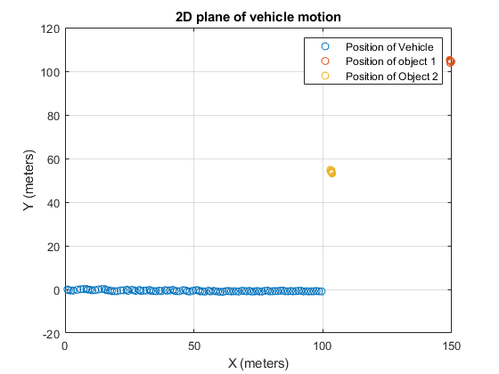
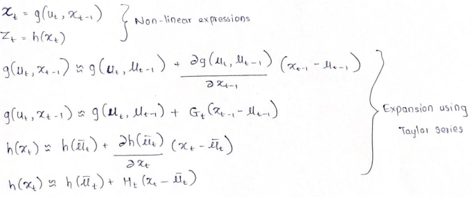
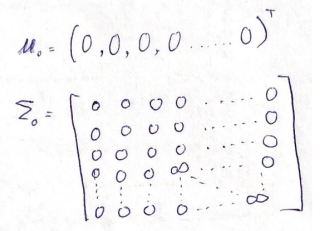
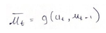
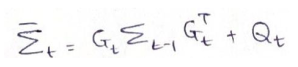
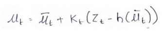
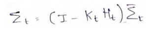
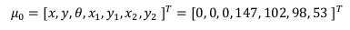
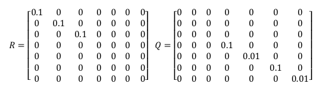

# Simultaneous Localization and Mapping (SLAM) using Extended Kalman Filter

## The Problem of SLAM
Simultaneous Localization and Mapping (SLAM) is a computational problem of constructing and updating a map of unknown environment while simultaneously keeping a track of robot’s location within it. The robot is able to estimate its location and positions of landmarks in an unknown environment given the robot controls and observations of the nearby features or landmarks over discrete timesteps.

SLAM is a chicken-egg problem, meaning, a map is needed for localizing a robot while a good pose estimate for the robot is needed to build a map. SLAM is regarded as one of the hardest problems in robotics. This is because both – the robot pose and map are unknown at initial timestep. Hence, errors are induced in the system thus, reducing the reliability of safe operations of robot in the real world.

In this project, EKF SLAM is used to determine the location of vehicle in a 2-D world. The EKF SLAM works on the principle of Extended Kalman filter technique. Two inputs are required to locate the vehicle using EKF SLAM - one, map of the environment and second, sequence of sensor measurements. Given these inputs, EKF SLAM can estimate vehicle’s position at any timestep. The EKF SLAM can thus be used for position tracking, global localization, vehicle in an unknown environment problem, etc.

The EKF SLAM works in five steps – local linearization step, initialization, prediction step, recording of measured values of environment and correction step.

### Step 1: Local linearization
The non-linear function of system state is first linearized locally so that the Kalman filter algorithm can then be used for it. The linearization of the state function is done by performing Taylor expansion. First two terms of the Taylor expansion are approximated as the state function and higher order terms
are neglected. Subsequently we obtain the following expression for state of the system at any time-step t.

Jacobians of the matrices here (G_t and H_t) do the linear transformation of the function by creating a tangent plane to each point in the 3D space so as to locally linearize it.

### Step 2: Initialization
The system needs to have some initializing parameters to compute the state of the system at subsequent timesteps. Initially, robot starts in its own reference frame, all landmarks are unknown. If there are N landmarks on the map, to initiate the EKF SLAM process, the state vector of mean estimates is assumed to be a vector of zeros. Also, the error covariance matrix is required to initiate the process. All the elements of covariance matrix are set zero apart from the diagonal elements that correspond to the landmarks. Ideally, for unknown landmarks, error covariance of infinite is set since we have no clue about them. Therefore, the state vector of mean estimates and covariance matrix required to initialize look like this,

### Step 3: Prediction
Again, the prediction step in EKF SLAM is similar to EKF, first the mean estimate of system state is computed based on the state vector of the system at previous timestep and the motion input to the system.

u_t in this equation is the motion input to the system and μ(t-1) is the mean state vector of the system at previous timestep.

Subsequently, error covariance for the current timestep is predicted based on the previous timestep and linearizing Jacobian matrix (G_t). The system noise covariance (R_t) is accounted for in this step.

### Step 4: Measured values of the environment recorded
In this step, the data available from the system sensors is recorded. The data is usually in parameters that can be measured like – distance, angle, temperature, etc. This observation is recorded as z_ti, where i is the number of observation at any time-step t.

### Step 5: Correction
First the Kalman gain is calculated based on the predicted error covariance and Jacobian matrix of observation (H_t). The measurement noise covariance it accounted in this step,

After obtaining the value for Kalman gain, the state vector of the system is updated. Depending on its trust on predicted value and measured value, the EKF makes changes to the state vector of the system. This new state vector for the current timestep gives the data of current pose of the vehicle as well as the location of obstacles or object from the vehicle’s current location in global coordinates.

Subsequently, the error covariance of the current timestep is calculated.

This state vector for system at current timestep is again fed into the prediction step to find mean estimate of state vector at next timestep. Similarly, the error covariance computed at the end of first timestep is fed into the prediction step to predict the error covariance at next timestep.

## Problem Description:
A vehicle initially stops in an unknown environment. It detects two obstacles based on its onboard lidar. The initial vector in EKF SLAM is defined as

where (𝑥, 𝑦, 𝜃) is the robot states, and (𝑥_1 , 𝑦_1) and (𝑥_2 , 𝑦_2) are locations of the two objects.

The vehicle moves in a straight line with a constant speed 𝑣_𝑡 = 1 𝑚/𝑠, (𝜔_𝑡 = 0). As the vehicle moves, the lidar detects the relative distances and relative angles of the two objects: (𝑟𝑟 1 , 𝜙𝜙 1 )
and (𝑟^2, 𝜙^2) in units of meter and radian, which are saved in file “s1.mat” and “s2.mat”. The sampling time is Δ𝑡 = 1 𝑠.
The noises in the motion and sensing are both Gaussian 𝑁(0, 𝑅) and 𝑁(0, 𝑄), where

Implemented EKF SLAM in Matlab to find out the locations of the vehicle and the two objects, i.e., updated 𝜇 based on the data in “s1.mat” and “s2.mat”.
It is a simple straight-line motion, so steering is ignored in the motion model.

